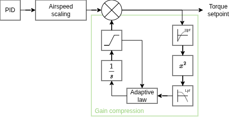

# Gain compression
Automatic gain compression reduces the gains of the angular-rate PID whenever oscillations are detected. It monitors the angular-rate controller output through a band-pass filter to identify these oscillations.

This approach is a safe adaptive mechanism for stable aircraft: the PID gains remain unchanged when no oscillations are present, they are never increased beyond their nominal values, and they are bounded by a minimum limit.

Gain compression can help prevent actuator damage and even loss of the vehicle in cases such as airspeed-sensor failure (loss of airspeed scaling) or in-flight changes in dynamics (e.g.: CG shifts, inertia changes), or other failures that could cause the angular-rate loop to become oscillatory.

::: info
Gain compression should be disabled during tuning to avoid over-tuning
  :::

## Parameters

- [FW_GC_EN](../advanced_config/parameter_reference.md#FW_GC_EN)
- [FW_GC_GAIN_MIN](../advanced_config/parameter_reference.md#FW_GC_GAIN_MIN)
